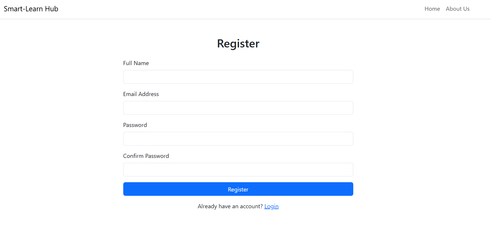
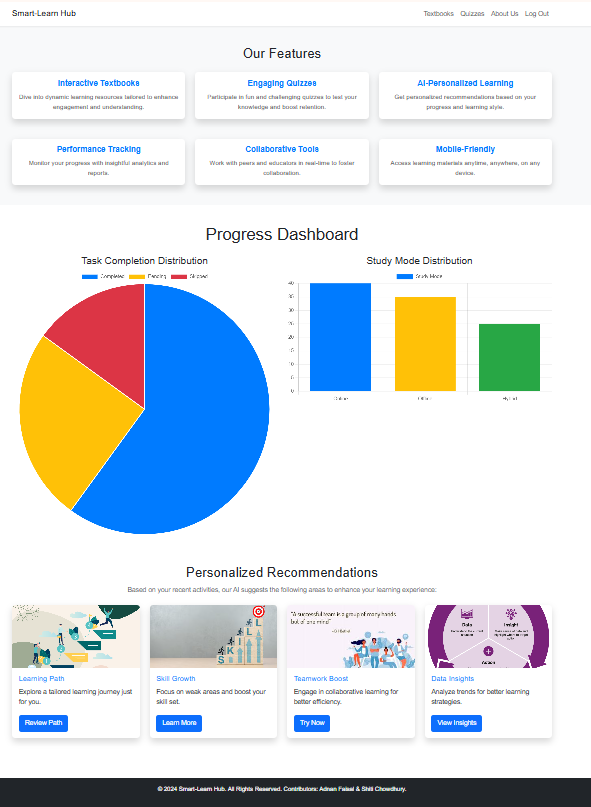
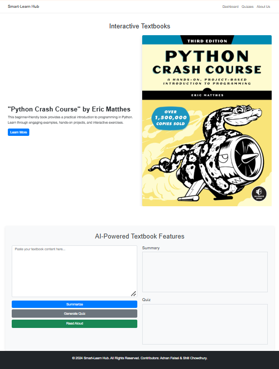

# Smart-Learn Hub

Smart-Learn Hub is an AI-driven educational platform designed to enhance the learning experience through personalized and interactive tools. This repository contains all the necessary code and resources for the Smart-Learn Hub project, including AI-powered functionalities, responsive web pages, and interactive elements.

---

## Thumbnail 

---
## Video Demo
Watch our platform:
[](https://youtu.be/dgEm9F5rejA)
---

## Features
- **AI-Powered Registration & Login**: Secure access with real-time password strength checker.
- **Interactive Textbook Page**: AI-enhanced features such as content summarization and quiz generation.
- **Dashboard**: Personalized insights, study analytics, and recommendations.
- **Quiz Page**: Interactive quizzes for skill assessment and improvement.
- **Responsive Design**: Seamless experience across all devices.

---

## Collaborators

### 1. **Adnan Faisal**
- **Role**: Developer
- **GitHub**: [Adnan Faisal](https://github.com/AJFaisal002)
- **LinkedIn**: [Adnan Faisal](https://www.linkedin.com/in/ajfaisal002/)
- **Email**: [ajfaisal1208023@gmail.com](ajfaisal1208023@gmail.com)

### 2. **Shiti Chowdhury**
- **Role**: Developer
- **GitHub**: [Shiti Chowdhury](https://github.com/SHITICHY21)
- **LinkedIn**: [Shiti Chowdhury](https://www.linkedin.com/in/shiti-chowdhury/)
- **Email**: [shitichowdhury21@gmail.com](shitichowdhury21@gmail.com)

---

## Screenshots

# **Home Page**


# **Registration Page**


# **Dashboard Page**


# **Textbook Page**


# **Quiz Page**


---

## How to Contribute
1. Fork the repository.
2. Clone the repository to your local machine.
   ```bash
   git clone https://github.com/AJFaisal002/Smart-Learn-Hub
   ```
3. Create a new branch for your feature.
   ```bash
   git checkout -b feature-name
   ```
4. Commit your changes and push the branch.
   ```bash
   git add .
   git commit -m "Add your message here"
   git push origin feature-name
   ```
5. Open a pull request to the main repository.

---

## Contact
For any queries or feedback, feel free to contact the collaborators through their provided email addresses.
